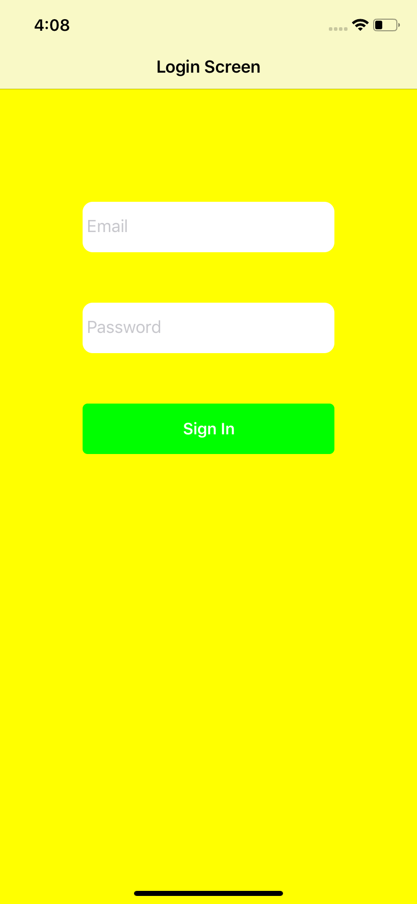
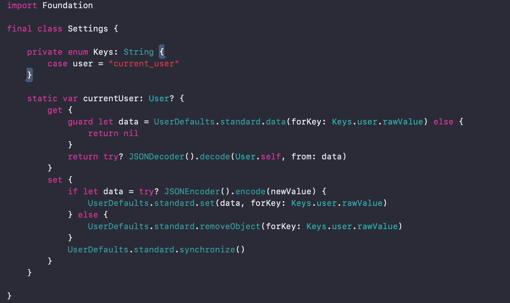
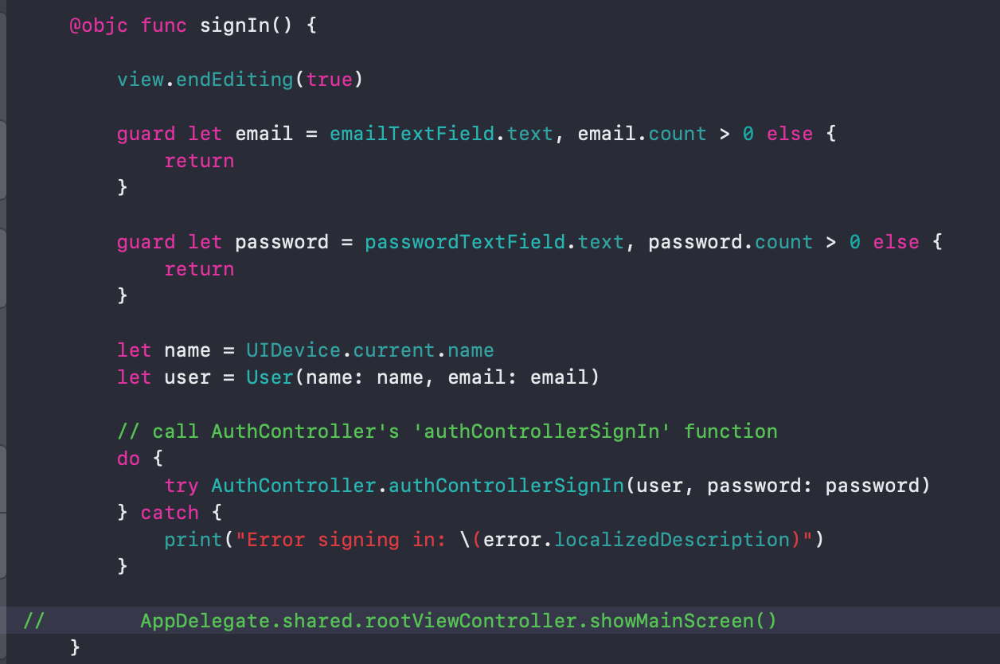

<h2>Swifty Snacks 106: Safe from harm</h2>

In 105, we used NSUserDefaults to record ‘session status.’ This approach is flawed, as it does not offer adequate protection against intrusive hackers.

In this adventure we will endeavour to upgrade our app’s defences, using Apple’s Keychain technology.

To start, let’s add two new TextFields (namely: emailTextField & passwordTextField) and a SignIn button to our RegistrationLoginController.

Notice, the we have defined a TextFieldTag enum (enumeration). This will come in handy when targeting individual text fields. According to standard practice, we then proceed to add our elements as subviews and position them on our view controller’s view. Lastly, we specify which method should be called when our new button in selected: signIn().

Add an extension, to RegistrationLoginController, to access optional methods concerned with editing and validating text entered into our textfield objects.

Implement ‘textFieldShouldReturn’ to insert instructions when the keyboard’s return button is pressed. The guard statement (// 1) checks to see if the textfield, in focus, is empty. If so, the function returns false and terminates before traversing through the switch statement. Otherwise, if the emailTextField is in focus, pressing return will change the views focus to the passwordTextField. Alternatively, if passwordTextField is the first responder, the switch statement will execute the signIn() function.

The signIn() function, will act as our first step toward embedding the sensitive information collected with Apple’s Keychain technology. We will use this function to gather all the data that we intend to encrypt. To help, with this task, let’s build a custom ‘User’ data type (aka struct) to provide storage of it’s associated properties: name & email.

Begin by commenting-out 105’s implementation of UserDefaults (// 1). Dismiss the keyboard (// 2). Ensure that both the email and password text fields contain text (// 3), if so capture the email and password user input, otherwise return. Next (in // 4), assign values to ‘name’ and ‘user’ constant declarartions. Add the current device name to ‘name’, before adding ‘name’ and ‘email’ (text entered into our email textField) into an instance of our custom data type.

Apple’s keychain is a specialised database for storing sensitive information. It is one of the most important security elements available for iOS developers. Let’s use it to store critical user data. Interacting directly with the framework is complicated, as it is mostly written in C. Fortunately, we can use ‘KeychainPaswwordItem’, a Swift wrapper layer from Apple’s sample code (GenericKeychain), as it serves as an easy-to-use interface to the Keychain framework.

To complement Keychain, let’s add ‘CryptoSwift,’ via cocoapods. If an attacker were to compromise Apple’s Keychain, she could read sensitive user information in a plain text file. CryptoSwift will act to store a ‘hash’ constructed from the user’s sensitive data.

Create AuthController.swift, a static class to control the app’s authentication. Apple’s KeychainPasswordItem gives access to its ‘savePassword’ method, which stores a password string securely in the Keychain. Create a KeychainPasswordItem with a defined ‘service name’ constant declaration, along with a unique identifier: the user’s email.
Proceed to store the user in UserDefaults by setting ‘Settings.currentUser.’

At this stage we have stored the user’s password, in Keychain, as plain text. To align with best practice let’s use CryptoSwift to store the password as unintelligible text.

‘passwordHash’ accepts an email and a password. Inside the function we add a ‘salt’ constant declaration, this is a random data string used as an additional input to our one-way hashing function. Salts defend against dictionary attacks, whereby systems iterate through a large list of passwords with the aim of stumbling across those used in your app. Adding a salt greatly increases the defense against dictionary attacks, as the invader would have to correctly guess the applied salt in addition to app passwords. The function completes by applying a SHA-2 hash on a string built by concatenating password, email, & salt strings. Modify class func signIn, to feed the hashed string into KeychainPasswordItem’s ‘savePassword’ method.

Return to RegistrationLoginController and complete it’s signIn() method, so as to call the AuthController’s authControllerSignIn function. Comment out the last line, used previously to switch to our apps MainScreen navigation stack.

Now that we have saved the user and a hashed password it’s time to use this data to manage the presentation of state appropriate UINavigation stacks. In AuthController.swift we will provide a method to establish whether the app user is ‘signedIn.’

Here, the isSignedIn method returns ‘false’ if our current user is not set. Otherwise, if a password exists, thus satisfying the condition that it’s text contains greater than zero characters, the method returns true.

At the bottom of AuthController.swift use an Notification.Name extension to define a static constant declaration for ‘loginStatusChanged.’

From Swifty Snack 105 we know that our RootController class toggles dictates which UINavigation stack is presented to the user. Now we shall edit it’s init() method, to assign it as an observer to our ‘.loginStatusChanged’ NavigationCenter call. Thus, when the app’s ‘.loginStatusChanged’ is fired RootController will execute its changedStatus method. If ther current user is signed in the app will switch from the RegistrationLoginController to the MainController. Alternatively, the app will continue to present or revert to the RegistrationLoginController.

Return to AuthController.swift to construct a pathway for users to sign out of our app. Add the signOut() method.

Here we check to see if the currentUser is set. If not, we exit the method as the user does not need to be signed out. Else, if the user is signed in, we delete her password hash form the Keychain, then reset the currentUser to equal nil. Lastly, we send out our .loginStatusChanged call, to responsive controllers.

Inside our MainController.swift, update the logout() function to call AuthController’s logout() function.

After displaying the initial SplashController, our app is now configured to either display the RegistrationLoginController or its MainController, dependant on the login status of the user.

“The most important trick to be happy is to realize that happiness is a choice that you make and a skill that you develop. You choose to be happy, and then you work at it. It’s just like building muscles” — Naval Ravikant
